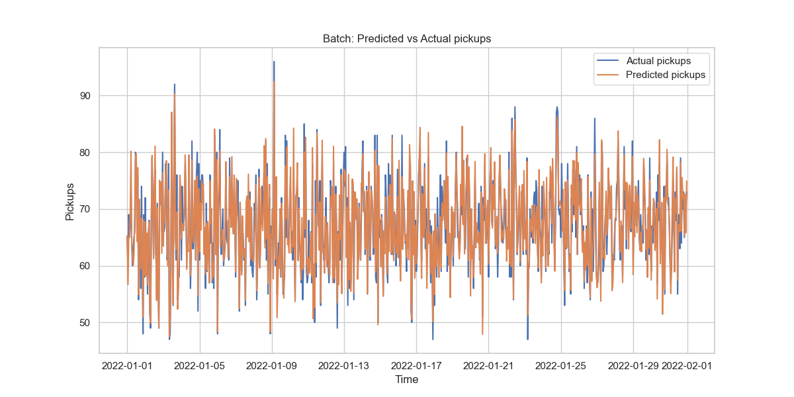
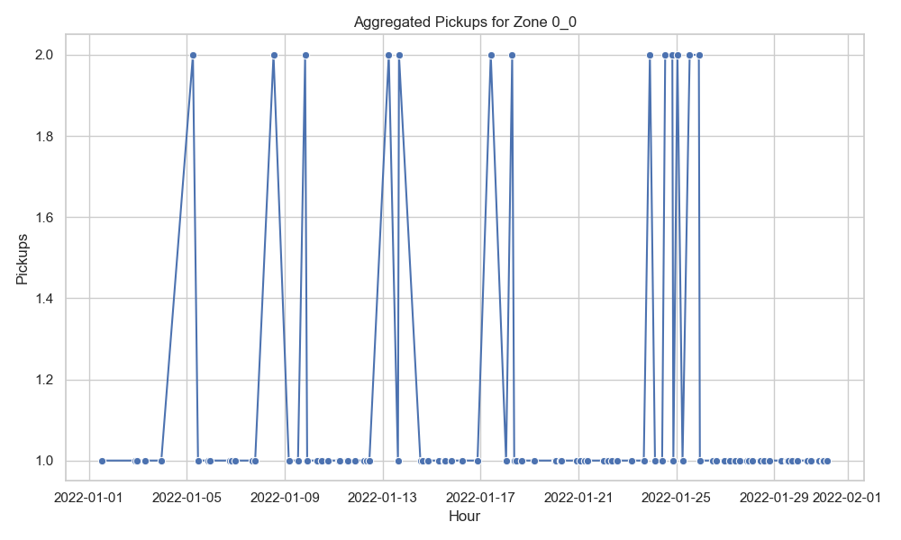

# NYC Taxi Pickup Prediction – Streaming & Batch Demo

This project demonstrates a prototype for **predicting NYC taxi pickups** using both **batch and streaming workflows**.  
Due to time constraints, **synthetic data** is generated instead of using the full dataset.

---

## 1. Model and Predictions

We train a **gradient boosting model (XGBoost)** to predict the number of pickups per zone and hour based on features:

- `prev_1h`: pickups in the previous hour  
- `prev_3h_mean`: mean pickups in the previous 3 hours  
- `hour`: hour of day  
- `weekday`: day of the week  

**Prediction modes:**

- **Batch:** predict on an existing CSV of aggregated data  
- **Streaming:** predict on events in real-time from Kafka

**Example prediction output:**



### Setup Batch Prediction:
```bash
# Create Python env
conda create -n nyc_taxi python=3.11
pip install -r requirements.txt

# Generate synthetic CSV
python generate_synthetic.py --rows 50000 --out data/yellow_tripdata_2022-01_sample.csv

# Run EDA & aggregation
python eda_and_aggregation.py --in data/yellow_tripdata_2022-01_sample.csv --out output

# Train model
python train_model.py --in output/agg_zone_hour.csv --out models

# Batch prediction
python predict_batch.py --in output/agg_zone_hour.csv --model models/pickup_model.joblib --out predictions.csv

```


## 2. Batch vs Streaming Prediction

- **Batch prediction:** reads CSV → aggregates → predicts → writes CSV  
- **Streaming prediction:** consumes events from Kafka → predicts on each micro-batch → writes results to output folder  

### Kafka & Spark Setup
```bash
# Start Zookeeper:
C:\spark\kafka_2.13-3.5.0\bin\windows\zookeeper-server-start.bat C:\spark\kafka_2.13-3.5.0\config\zookeeper.properties

# Start Kafka broker:
C:\spark\kafka_2.13-3.5.0\bin\windows\kafka-server-start.bat C:\spark\kafka_2.13-3.5.0\config\server.properties

# Create Kafka topic:
C:\spark\kafka_2.13-3.5.0\bin\windows\kafka-topics.bat --create --topic taxi-events --bootstrap-server localhost:9092 --partitions 1 --replication-factor 1

# Simulate events:
python simulate_stream_to_kafka.py --csv data/yellow_tripdata_2022-01_sample.csv --topic taxi-events --brokers localhost:9092

# Run stream predictor:
spark-submit --packages org.apache.spark:spark-sql-kafka-0-10_2.13:3.5.0 stream_predict.py --brokers localhost:9092 --topic taxi-events --model models/pickup_model.joblib --out stream_predictions
```

## 4. EDA and Aggregation

We perform **Exploratory Data Analysis (EDA)** and aggregation to understand trends in pickups per zone and per hour:

- Time series plots for hourly pickups  
- Aggregation per `zone_id`, `hour`, `weekday`  

**Example aggregated data plot:**



---

## 5. Validation

We validate the model using:

- **Train/test split** on synthetic aggregated data  
- **Metrics:** Mean Absolute Error (MAE) / RMSE  
- Comparison between **predicted vs actual pickups**

**Validation plot:**


---

## 6. Synthetic Data

Due to time limitations and large NYC taxi dataset size, we **generate synthetic CSV data** using `generate_synthetic.py`. This simulates realistic pickup patterns for testing batch and streaming workflows.
